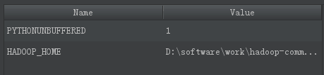

# 常用软件安装
---

**Markdown**

[Learning-Markdown](http://xianbai.me/learn-md/)

## **pycharm** 安装

1.安装 python2.7.13，完成后命令行使用 python 查看

2.安装 Pycharm

3.下载Spark的安装包，解压到 E:\\spark\\spark-2.1.0-bin-hadoop2.7

4.设置 SPARK 的环境变量 SPARK_HOME 和 Path

5.下载 Hadoop，其中包含一个文件 winutils.ext,文件夹在 E:\\hadoop-common-2.2.0-bin-master，并且在环境变量中设置 HADOOP_HOME

6.将 spark 路径 E:\\spark\\spark-2.1.0-bin-hadoop2.7\\python 中 pyspark 文件夹全部拷贝到 Python 安装环境下的 site-packages 中：E:\\SoftWare Tools\\Python\\PythonEnvironment\\Lib\\site-packages

7.打开 Pycharm，写 spark 程序时，遇到 py4j 的错误，解决办法：需要将 py4j 的包导入到 Python 环境变量下的 site-packages 下。

8.在 pycharm 中的 run->edit configurations->environment variables 中设置 HADOOP_HOME 的值，如



- 跳过注册码

在我的电脑地址栏输入

```
%LocalAppData%\Atlassian\SourceTree\
```

于是打开 SourceTree 的文件夹,新建 accounts.json 该文件的内容如下:

```
[
  {
    "$id": "1",
    "$type": "SourceTree.Api.Host.Identity.Model.IdentityAccount, SourceTree.Api.Host.Identity",
    "Authenticate": true,
    "HostInstance": {
      "$id": "2",
      "$type": "SourceTree.Host.Atlassianaccount.AtlassianAccountInstance, SourceTree.Host.AtlassianAccount",
      "Host": {
        "$id": "3",
        "$type": "SourceTree.Host.Atlassianaccount.AtlassianAccountHost, SourceTree.Host.AtlassianAccount",
        "Id": "atlassian account"
      },
      "BaseUrl": "https://id.atlassian.com/"
    },
    "Credentials": {
      "$id": "4",
      "$type": "SourceTree.Model.BasicAuthCredentials, SourceTree.Api.Account",
      "Username": "",
      "Email": null
    },
    "IsDefault": false
  }
]
```

## 参考资料

[SnailTyan](http://noahsnail.com/)

[Windows平台下单机Spark环境搭建](https://yxnchen.github.io/technique/Windows%E5%B9%B3%E5%8F%B0%E4%B8%8B%E5%8D%95%E6%9C%BASpark%E7%8E%AF%E5%A2%83%E6%90%AD%E5%BB%BA/)
