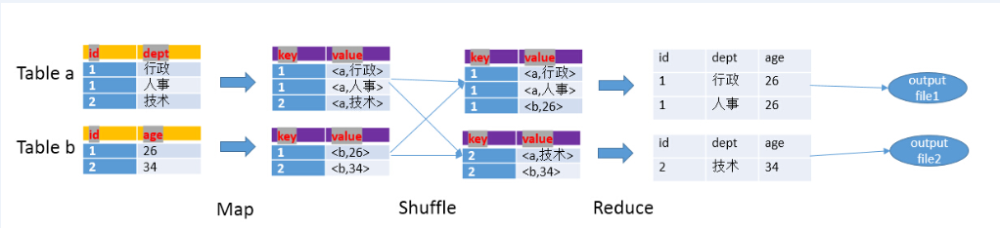

# Spark
---

## Hive

### 关联


hive中join的方式分为两种，一种是Common Join(Reduce阶段完成join)和Map Join(Map阶段完成join)

- Map阶段

    - 读取元数据 , 输出key和values

- Shuffle阶段

    - 将key和values按照不同的hash值推送到不同的reduce，确保两个表中相同的key位于同一个reduce中

- Reduce阶段

    - 根据key的值完成join操作，期间通过Tag来识别不同表中的数据



### Map Join


总结:
   
使用场景:
    
(1)  有一个极小的表<1000行
    
(2)  需要做不等值join操作(a.x < b.y 或者 a.x like b.y)


```sql
select /*+MAPJOIN(a) */ a.start_level,b.* fromdim_level a join (select * fromtest) b where b.xx>=a.start_level and b.xx<end_level;
```

## hbase 

### 基本操作

1 创建命名空间

```
create_namespace 'ai_ns'
```

2 删除空间

```
drop_namespace 'ai_ns'
```

3 查看空间

```
list_namespace
```

4 插入数据

```
put 'quant:quant_meta','quant_v1','f1:table','quant_20170'
```

## 参数配置

1 在 **Spark** 上配置 **Anaconda**:

```
export PATH="/opt/cloudera/parcels/Anaconda/bin:$PATH"
export PYSPARK_PYTHON=/opt/cloudera/parcels/Anaconda/bin/python
```
    
2 从两个不同的集群复制文件

```
hadoop distcp hdfs:/cluster/user/a/b /user/a/b
```

3 删除垃圾回收站中文件

```
hadoop fs -rm -R -skipTrash /user/jiaoruiqiang/.Trash/Current/user/hive/warehouse/a.db
```

### Spark提交任务的一些参数

- --class 入口类名，对于Java和Scala程序来说是包含main()的类的名字，python程序则无须指定该选项

- --master 集群master的地址
    
    - local     ：以本地单线程运行Spark
    
    - local[N]  ：以本地多个线程运行Spark
    
    - local[*]  ：以本地模式运行Spark，线程数等于机器的内核数
    
    - spark://host:port ：连接指定的Standalone集群运行spark
    
    - yarn-client ：以client模式连接到YARN集群，集群位置将通过HADOOP_CONF_DIR环境变量获得
    
    - yarn-cluster ：以cluster模式连接到YARN集群，集群位置将通过HADOOP_CONF_DIR环境变量获得
    
    - mesos://host:port ： 连接指定的Standalone集群运行spark
    
- --deploy-mode 程序部署模式

  将driver部署到worker节点(cluster模式)或者作为外部客户端部署到本地(client模式)，默认情况下是client模式
  
  - client：执行Spark-submit命令的机器上启动Drive程序
    
  - cluster：会在其中一台工作节点上运行drive程序
    
- --jars  第三方发布的Jar包，多个jar包需要用英文的逗号隔开

- --num-executors：executor进程数

- --executor-cores：

executor进程分配到的核数,单个executor能并发执行task数

- --executor-memory：executor进程分配到的内存大小，根据job需求以及并发数设置

- --py-files：用于上传.py,.zip和.egg的文件

- --driver-memory：指定drive进程进行分配内存大小

- --conf spark.storage.memoryFraction：设置内存用来作为cache的比例(=0.1)

- --conf spark.hadoop.fs.hdfs.impl.disable.cache：禁止使用内存cache(=true) 

- --conf spark.default.parallelism: 控制Spark中的分布式shuffle过程默认使用的task数量，默认Others: total number of cores on all executor nodes or 2, whichever is larger，每一个CPU核(core)分配2-3个任务(=400)

- --conf spark.yarn.executor.memoryOverhead: JVM进程中除Java堆以外占用的空间大小，包括方法区(永久代)、Java虚拟机栈、本地方法栈、JVM进程本身所用的内存、直接内存(Direct Memory)等(=5000)

- --conf spark.kryoserializer.buffer: 在每一个work的每一个core上都有一个初始化的buffer, 这些buffer的最大的可达到conf spark.kryoserializer.buffer.max参数设置的参数

- --conf spark.kryoserializer.buffer.max 用来设置对象序列化占用空间大小(=2000m)

- --conf spark.driver.maxResultSize:表所有分区的序列化运行总的内存限制 ,控制worker送回driver的数据大小，一旦操过该限制，driver会终止执行(=10g) 
